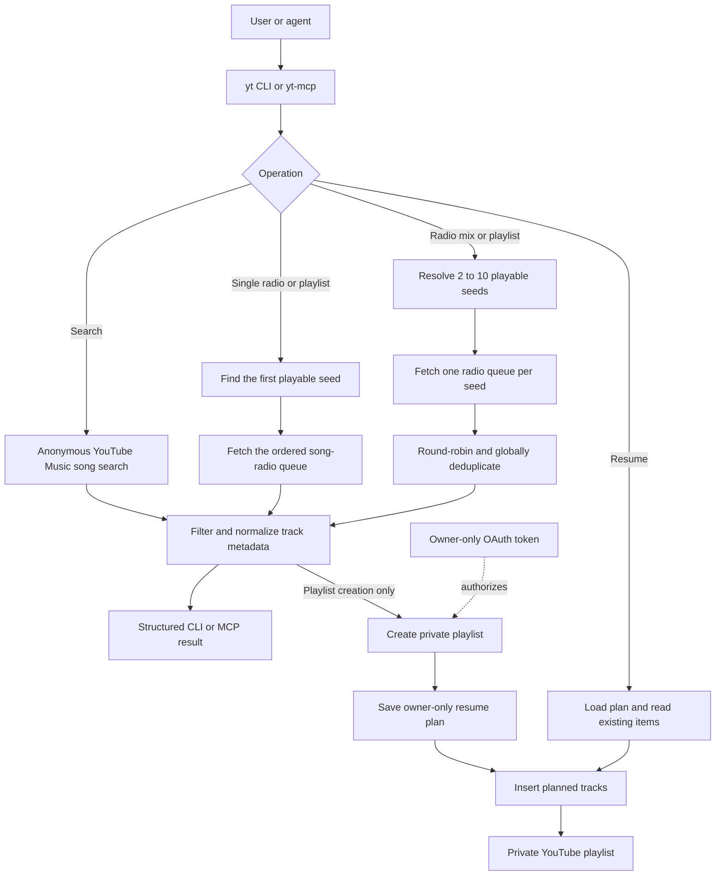

# yt-mcp

A small Python CLI and MCP server I built to create YouTube Music radio mixes
and private playlists from multiple seed songs.

I wanted something YouTube Music itself did not give me easily: start from
several songs that define a mood, merge their radio queues, remove duplicates,
and turn the result into a playlist I can actually keep.

What started as a recommendation problem quickly became an engineering problem
around safe writes and recovery: OAuth, resumable playlist creation,
deterministic mixing, validation, and explicit read/write boundaries.

## How It Works



## Features

- Search YouTube Music without authentication
- Build a radio queue from one song
- Mix radio queues from two to ten seed songs
- Create private playlists
- Resume interrupted playlist creation
- Use the same functionality through MCP

## Quick Start

Requires Python 3.10+ and [uv](https://docs.astral.sh/uv/).

```sh
uv sync --locked
```

```sh
uv run --locked yt search "Alan Sorrenti Figli delle stelle"
uv run --locked yt radio "Alan Sorrenti Figli delle stelle" --limit 30
uv run --locked yt radio-mix \
  "Tourist LeMC Adem" \
  "Brihang Steentje" \
  "Yong Yello Luchtkasteel" \
  --limit 50
```

`radio` uses the first playable search result and reports the selected seed.
Pass `--video-id VIDEO_ID` to select a specific recording, or `--json` for
structured output.

## How Radio Mixing Works

`radio-mix`:

1. Resolves every query to a playable seed.
2. Fetches one ordered radio queue per seed.
3. Takes one new track from each queue in seed order, then repeats.
4. Removes all seed songs and duplicate video IDs across queues.
5. Stops at the total `--limit` (default 50, maximum 100).

For fixed input queues, mixing is deterministic. YouTube Music can return
different queues between calls, and exhausted queues produce a shortfall rather
than filler tracks. Search and radio remain anonymous and never change an
account.

## Creating Playlists

Playlist writes use Google OAuth and the official YouTube Data API. Create a
Google OAuth client of type **TVs and Limited Input devices**, save it as
`oauth-client.json`, and authorize the account:

```sh
chmod 600 oauth-client.json
uv run --locked yt auth oauth
```

Then create a private playlist from a fresh multi-seed mix:

```sh
uv run --locked yt playlist create-mix "Belgian evening" \
  "Tourist LeMC Adem" \
  "Brihang Steentje" \
  --description "Warm Belgian mix" \
  --limit 50
```

Before inserting the first track, the command saves the exact write plan in an
owner-only state file. If insertion is interrupted, resume the same playlist:

```sh
uv run --locked yt playlist resume PLAYLIST_ID
```

Resume verifies that the remote playlist is still private and matches the
expected prefix before appending only the missing tracks. Completed retries are
no-ops; concurrent resumes for the same playlist are not supported.

See [OAuth and playlist recovery](docs/oauth.md) for complete setup, credential
handling, and recovery details.

## MCP Server

`yt-mcp` starts a local stdio MCP server with six focused tools:

| Tool | Effect |
| --- | --- |
| `search_songs` | Read-only song search |
| `get_song_radio` | Read-only radio recommendations |
| `get_multi_seed_radio` | Read-only round-robin mix from two to ten song radios |
| `create_private_radio_playlist` | Creates one private playlist from a song radio |
| `create_private_multi_seed_radio_playlist` | Creates one private playlist from a multi-seed mix |
| `resume_private_playlist` | Reconciles and completes a playlist from its saved plan |

Read tools are anonymous and do not load account credentials. Write tools
require OAuth and are deliberately separated from read-only operations. The
server exposes no generic method for arbitrary `ytmusicapi` calls.

If you want to run write tools without per-call approval, install a reviewed
snapshot outside agent-writable workspaces rather than trusting a mutable
checkout.

See [MCP setup](docs/mcp-setup.md) and
[MCP security and approvals](docs/mcp-security.md).

## Design Decisions

- **Reads stay anonymous where possible.** Search and radio discovery do not
  need access to a Google account.
- **Writes are explicit.** Playlist creation is separated from read-only
  operations in both the CLI and MCP interface.
- **Write plans are saved before mutation.** An interrupted playlist can be
  resumed without recomputing a different radio mix.
- **Resume verifies remote state.** It continues only when the existing playlist
  matches the expected prefix.
- **Tests don't touch real accounts.** External clients are replaced with fakes
  during automated tests.

## Development

```sh
uv run --locked pytest
```

Tests use fake clients and make no network or account changes. The
[implementation plan](docs/plan.md), [multi-seed plan](docs/multi-seed-plan.md),
and [resume plan](docs/resume-plan.md) document scope and acceptance criteria.

## Limitations

- Search and radio depend on YouTube Music's unofficial internal API.
- Results may change between calls and contain fewer tracks than requested.
- Playlist writes use the official YouTube Data API and require Google OAuth.
- Concurrent resume operations for the same playlist are not supported.

## License

MIT. See [LICENSE](LICENSE).
