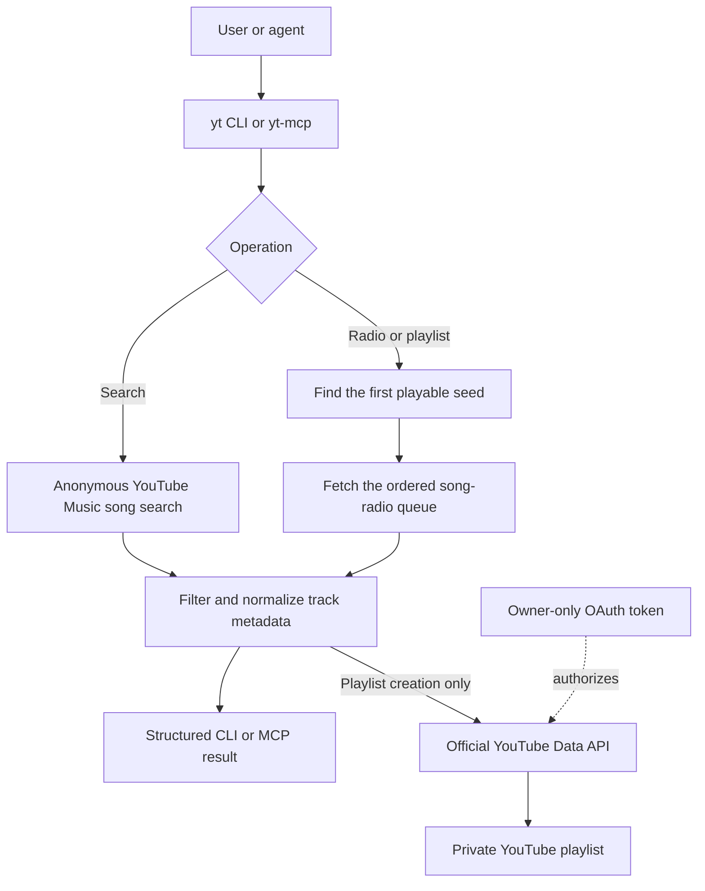

# yt-mcp

Search YouTube Music, fetch song-radio recommendations, and create private
playlists from a CLI or a local MCP server.



Requires Python 3.10+ and [uv](https://docs.astral.sh/uv/).

```sh
uv sync --locked
uv run yt search "Alan Sorrenti Figli delle stelle"
uv run yt radio "Alan Sorrenti Figli delle stelle" --limit 30
```

The `radio` command uses the first playable search result and shows the selected
seed. To choose a specific recording, copy its 11-character ID from `search`:

```sh
uv run yt radio --video-id VIDEO_ID --limit 30
uv run yt radio "Alan Sorrenti Figli delle stelle" --limit 30 --json > radio.json
```

Search and radio run anonymously. They read no account credentials and make no
account changes. Recommendations preserve YouTube's order, exclude the seed,
skip unavailable tracks, and remove duplicate video IDs. Results can vary and
can contain fewer songs than requested.

Structured CLI and MCP track results include `videoId`, `title`, `artists`,
`album`, `duration`, `duration_seconds`, and `url`. `album` and
`duration_seconds` are nullable because YouTube Music does not return them for
every item. The numeric duration is suitable for cross-catalog matching while
the original display duration remains available for compatibility.

## Connect a Google account with OAuth

Playlist creation uses Google OAuth. It never asks for or stores the Gmail
password. The OAuth consent grants the broad `youtube` scope, which can manage
the connected YouTube account; use a Google Cloud project you control and revoke
the grant from the Google account when it is no longer needed. Radio discovery
stays anonymous; authenticated writes use the official YouTube Data API.

1. In Google Cloud, enable the YouTube Data API, configure the OAuth consent
   screen, and create an OAuth client of type **TVs and Limited Input devices**.
2. If the consent screen is in testing, add the intended Google account as a
   test user. Download the client JSON to this repository as `oauth-client.json`.
3. Create the local environment file and replace its placeholder paths with the
   absolute paths on your machine. No account email is needed in this file;
   Google asks you to choose the account during OAuth.
4. Restrict the client file and start the local device authorization flow:

```sh
cp .env.example .env
chmod 600 oauth-client.json
uv run --env-file .env --locked yt auth oauth
```

Choose the intended Google account in Google's browser page. The command writes
`oauth.json` with owner-only permissions. Both credential files are ignored by
Git. Do not paste their contents, the displayed device code, or tokens into chat.
On POSIX systems, playlist operations refuse either credential file when group
or other users have access; fix that with `chmod 600 FILE`.

The same OAuth client file must be available when the token refreshes. As an
alternative to `YTMUSIC_OAUTH_CLIENT_FILE`, the CLI accepts
`YTMUSIC_OAUTH_CLIENT_ID` and `YTMUSIC_OAUTH_CLIENT_SECRET` environment variables.

Create a private playlist from a fresh radio queue:

```sh
uv run --env-file .env --locked yt playlist create "Italiaanse zomeravond" \
  "Alan Sorrenti Figli delle stelle" \
  --description "Warme Italiaanse avondmuziek" \
  --limit 100
```

The command prints the new playlist URL. It fetches the radio again, so its
tracks may differ from an earlier `yt radio` result. The seed itself is excluded.
Add `--json` for structured output.

See the upstream [OAuth setup](https://ytmusicapi.readthedocs.io/en/stable/setup/oauth.html)
and Google's [YouTube OAuth guide](https://developers.google.com/youtube/v3/guides/authentication)
for the authorization model.

## Local MCP server

`yt-mcp` starts a local stdio MCP server with three focused tools:

| Tool | Effect |
| --- | --- |
| `search_songs` | Read-only song search |
| `get_song_radio` | Read-only radio recommendations |
| `create_private_radio_playlist` | Creates one private playlist in the connected account |

The write tool is marked non-read-only and non-idempotent in its MCP annotations,
so compatible hosts can request approval. The server has no generic method that
can invoke arbitrary `ytmusicapi` operations.

After `oauth.json` exists, register the server with the local Codex CLI:

```sh
PROJECT_DIR="$PWD"
UV_BIN="$(command -v uv)"
codex mcp add youtube-music \
  -- "$UV_BIN" \
     --directory "$PROJECT_DIR" \
     run --env-file "$PROJECT_DIR/.env" --locked yt-mcp
```

This stores the path to the ignored `.env` in the MCP configuration. The token
and OAuth client contents stay in their owner-readable files. The server uses
stdio and does not open a network listening port.

The project pins `ytmusicapi` to 1.12.2 and the official MCP Python SDK to major
version 2. `ytmusicapi` is used anonymously against YouTube Music's unofficial
internal API for search and radio, so upstream changes can interrupt discovery.
Private playlist creation and item insertion use Google's official YouTube Data
API with the local OAuth token.

## Development

```sh
uv run --locked python -m unittest discover -s tests -v
```

Tests use fake clients and make no network or account changes. A read-only live
smoke check is:

```sh
uv run --locked yt radio "Alan Sorrenti Figli delle stelle" --limit 5
```

See [the implementation plan](docs/plan.md) for scope and acceptance criteria.

## License

MIT. See [LICENSE](LICENSE).
