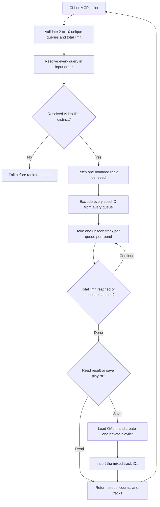

# Multi-seed YouTube Music radio mix

## 1. Evidence sources

- `yt_mcp.py` already resolves a song query to the first playable result,
  fetches a radio queue with `get_watch_playlist(..., radio=True)`, normalizes
  metadata, excludes the seed, and removes duplicate video IDs within one queue.
- `yt_mcp_server.py` exposes the same discovery behavior through read-only MCP
  tools and creates a fresh anonymous client for every call.
- `tests/test_cli.py` and `tests/test_mcp_server.py` establish JSON output,
  bounded MCP limits, sanitized upstream failures, and no OAuth dependency for
  discovery.
- The installed `ytmusicapi` 1.12.2 method accepts one `videoId` per radio call;
  a multi-seed result therefore requires one independent radio request per seed.
- Steven requested support for up to ten seed songs with equal influence,
  global deduplication, seed removal, and a total result such as 100 unique
  songs.
- Steven requested that the resulting multi-seed mix can be saved through the
  same authenticated private-playlist writer as a single-seed radio.

## 2. Current flow

The existing multi-seed CLI and MCP read paths accept two to ten queries and
return the mixed tracks. Only the single-seed radio currently has a CLI and MCP
path that sends its result to the authenticated private-playlist writer.

## 3. Desired flow

All calls remain synchronous. Discovery stays anonymous and read-only; only the
explicit save branch loads OAuth and writes through the official YouTube Data
API. YouTube Music owns search choice and radio contents; yt-mcp owns input
order, filtering, fairness, the output cap, and private-playlist enforcement.

## 4. Behavioral delta

### Changed

- Add CLI `yt playlist create-mix TITLE QUERY QUERY [QUERY ...]`.
- Add MCP `create_private_multi_seed_radio_playlist` with write annotations.
- Route the completed mix through the same private-playlist writer used by the
  single-seed flow.

### Unchanged

- `search`, `radio`, authentication, and single-seed playlist creation.
- Track metadata and video-ID validation.
- Anonymous discovery sessions, timeouts, and sanitized error boundaries.
- Round-robin ordering, global seed exclusion and deduplication, and the
  100-track output cap.
- Existing single-seed CLI, MCP, and result contracts.

### Excluded

- Weighted seeds, arbitrary queue ordering, automatic seed correction, and
  catalog matching.

## 5. Decisions and contracts

- Accept two to ten trimmed, case-insensitively distinct query strings. Ten is
  the application request bound; one seed continues to use `radio`.
- Require a total limit from the seed count through 100 so each seed can
  contribute at least once when its queue contains a unique result.
- Resolve all queries before requesting radios. If two queries select the same
  video ID, fail before any radio request and ask for more specific seeds.
- Fetch `limit + seed_count` items per radio because other seed songs can occupy
  queue positions. Normalize and cap every queue before mixing.
- Process seed queues sequentially; the shared synchronous client is not assumed
  thread-safe.
- During each round, advance a queue past globally seen IDs until it contributes
  one new track or is exhausted. Seed order breaks cross-radio ties.
- Initialize the global seen set with every resolved seed ID and stop exactly at
  the requested total. Preserve metadata from the first accepted occurrence.
- A failed seed search, malformed radio, or empty radio fails the whole request
  with its one-based seed position. A non-empty combined shortfall succeeds with
  `returned < requested` and a CLI warning.
- Return resolved seed metadata in input order so callers can detect an
  unintended first search match.
- Validate the complete multi-seed request before loading OAuth. Finish mixing
  before creating the playlist, so discovery failures cannot leave an empty
  playlist behind.
- If a non-empty mix falls short of the requested total, create the playlist
  with the available tracks and report the honest `trackCount`.
- Return the same playlist fields as the single-seed write, replacing `seed`
  with ordered `seeds` metadata.

## 6. Delivery steps

1. Extract the shared playlist-result writer from the single-seed orchestration.
2. Add a multi-seed orchestration function that discovers the complete mix
   before calling that writer.
3. Add the `playlist create-mix` CLI route and structured output.
4. Add the typed, explicitly mutating MCP tool.
5. Cover successful writes, annotations, validation ordering, and unchanged
   single-seed behavior with fake clients.
6. Document the new CLI and MCP contracts.

## 7. Acceptance criteria and tests

- Two to ten valid queries resolve in their input order; one, eleven, blank,
  and duplicate queries fail before client construction.
- Duplicate resolved video IDs fail before `get_watch_playlist` is called.
- Every radio is fetched once and sequentially with a bounded request size.
- No resolved seed ID can appear in `tracks`, even when another radio returns it.
- Cross-radio duplicate IDs appear once, and the first seed queue wins.
- Each active queue contributes at most one new track per round; a duplicate is
  skipped without forfeiting that queue's turn.
- Results stop exactly at the total limit and report honest shortfalls.
- CLI JSON remains valid when a warning is written to stderr.
- MCP discovery exposes the new typed tool as read-only and open-world.
- Multi-seed playlist creation produces exactly one private playlist containing
  the mixed, filtered IDs in their returned order.
- Invalid seeds fail before authentication, discovery, or playlist mutation.
- The MCP playlist tool is non-read-only, non-destructive, non-idempotent, and
  open-world.
- Unit tests perform no real network, OAuth, or playlist mutation.

## 8. Risks, rollout, and rollback

Each request performs two to ten anonymous YouTube Music searches followed by
the same number of radio calls, so it is slower and more exposed to unofficial
API changes than one radio. Recommendations can change between runs; only the
merge is deterministic for fixed input queues. Similar seeds may still produce
substantial overlap and a short result.

Saving up to 100 items consumes official YouTube Data API quota. Before the
first item insert, the writer now persists the exact plan. Handled API and
network failures report the playlist URL and resume command; process termination
can still be resumed by playlist ID without creating a duplicate.

Roll out additively while preserving the existing commands and tools. Rollback
removes `playlist create-mix` and
`create_private_multi_seed_radio_playlist`; no stored-data migration is
involved.
