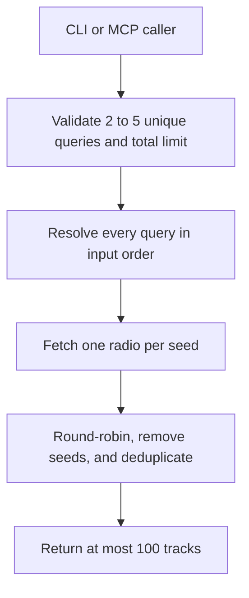
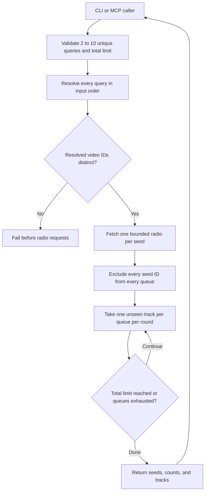

# Multi-seed YouTube Music radio mix

## 1. Evidence sources

- `yt_mcp.py` already resolves a song query to the first playable result,
  fetches a radio queue with `get_watch_playlist(..., radio=True)`, normalizes
  metadata, excludes the seed, and removes duplicate video IDs within one queue.
- `yt_mcp_server.py` exposes the same discovery behavior through read-only MCP
  tools and creates a fresh anonymous client for every call.
- `tests/test_cli.py` and `tests/test_mcp_server.py` establish JSON output,
  bounded MCP limits, sanitized upstream failures, and no OAuth dependency for
  discovery.
- The installed `ytmusicapi` 1.12.2 method accepts one `videoId` per radio call;
  a multi-seed result therefore requires one independent radio request per seed.
- Steven requested support for up to ten seed songs with equal influence,
  global deduplication, seed removal, and a total result such as 100 unique
  songs.

## 2. Current flow

The existing multi-seed CLI and MCP paths accept two to five queries. The
mixing algorithm already operates on a variable number of queues; the upper
bound is enforced by shared input validation.

## 3. Desired flow

All calls remain synchronous and read-only. YouTube Music owns search choice and
radio contents; yt-mcp owns input order, filtering, fairness, and the output cap.

## 4. Behavioral delta

### Changed

- Raise the shared maximum from five to ten seed queries.
- Update CLI help, MCP tool guidance, tests, and user documentation to expose
  the same limit.

### Unchanged

- `search`, `radio`, authentication, and single-seed playlist creation.
- Track metadata and video-ID validation.
- Anonymous discovery sessions, timeouts, and sanitized error boundaries.
- Round-robin ordering, global seed exclusion and deduplication, and the
  100-track output cap.

### Excluded

- Weighted seeds, arbitrary queue ordering, automatic seed correction, catalog
  matching, and a new multi-seed YouTube playlist-write tool.

## 5. Decisions and contracts

- Accept two to ten trimmed, case-insensitively distinct query strings. Ten is
  the application request bound; one seed continues to use `radio`.
- Require a total limit from the seed count through 100 so each seed can
  contribute at least once when its queue contains a unique result.
- Resolve all queries before requesting radios. If two queries select the same
  video ID, fail before any radio request and ask for more specific seeds.
- Fetch `limit + seed_count` items per radio because other seed songs can occupy
  queue positions. Normalize and cap every queue before mixing.
- Process seed queues sequentially; the shared synchronous client is not assumed
  thread-safe.
- During each round, advance a queue past globally seen IDs until it contributes
  one new track or is exhausted. Seed order breaks cross-radio ties.
- Initialize the global seen set with every resolved seed ID and stop exactly at
  the requested total. Preserve metadata from the first accepted occurrence.
- A failed seed search, malformed radio, or empty radio fails the whole request
  with its one-based seed position. A non-empty combined shortfall succeeds with
  `returned < requested` and a CLI warning.
- Return resolved seed metadata in input order so callers can detect an
  unintended first search match.

## 6. Delivery steps

1. Raise the central seed-query maximum from five to ten.
2. Update the CLI and MCP descriptions without changing their result contracts.
3. Add boundary tests that accept ten seeds and reject eleven before network
   access.
4. Synchronize the README and this design document with the new bound.

## 7. Acceptance criteria and tests

- Two to ten valid queries resolve in their input order; one, eleven, blank,
  and duplicate queries fail before client construction.
- Duplicate resolved video IDs fail before `get_watch_playlist` is called.
- Every radio is fetched once and sequentially with a bounded request size.
- No resolved seed ID can appear in `tracks`, even when another radio returns it.
- Cross-radio duplicate IDs appear once, and the first seed queue wins.
- Each active queue contributes at most one new track per round; a duplicate is
  skipped without forfeiting that queue's turn.
- Results stop exactly at the total limit and report honest shortfalls.
- CLI JSON remains valid when a warning is written to stderr.
- MCP discovery exposes the new typed tool as read-only and open-world.
- Unit tests perform no network, OAuth, or playlist mutation.

## 8. Risks, rollout, and rollback

Each request performs two to ten anonymous YouTube Music searches followed by
the same number of radio calls, so it is slower and more exposed to unofficial
API changes than one radio. Recommendations can change between runs; only the
merge is deterministic for fixed input queues. Similar seeds may still produce
substantial overlap and a short result.

Roll out by replacing the validation bound while preserving all existing
commands and tools. Rollback restores the maximum to five; no account or stored
data migration is involved.
