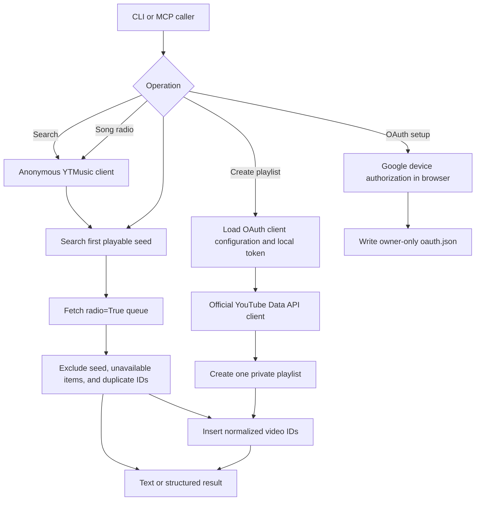

# YouTube Music radio, playlists, and MCP

## 1. Evidence sources

- Steven's target flow: start from a song, retrieve YouTube Music's radio queue,
  and save up to 100 recommendations as a playlist.
- Existing repository behavior provides anonymous `search` and `radio` CLI
  commands with normalized, deduplicated results.
- Installed `ytmusicapi` 1.12.2 signatures: `get_watch_playlist(..., radio=True)`,
  custom OAuth credentials, and refreshable OAuth token files.
- [ytmusicapi issue 813](https://github.com/sigma67/ytmusicapi/issues/813): OAuth
  requests to YouTube Music's internal endpoints fail with HTTP 400; browser
  authentication is the suggested workaround.
- [YouTube playlist implementation](https://developers.google.com/youtube/v3/guides/implementation/playlists):
  the official API supports OAuth-authorized private playlist creation and
  individual video insertion.
- [Official MCP Python SDK](https://github.com/modelcontextprotocol/python-sdk):
  SDK v2 supports typed tools, stdio transport, structured results, and behavioral
  annotations.

## 2. Current and desired behavior

Before this change, the app could inspect anonymous search and radio results but
could not authenticate, mutate a YouTube account, or serve MCP tools. The target
keeps anonymous reads and adds an explicit OAuth boundary for private writes.

All calls are synchronous and use a 30-second per-request timeout. The MCP server
runs locally over stdio. YouTube owns recommendation choice and order; this app
owns validation, filtering, privacy selection, output, and credential boundaries.

## 3. Behavioral delta and contracts

- `yt auth oauth` obtains a refreshable token through Google's browser flow and
  writes it atomically with mode `0600`. It refuses to replace an existing token.
- `yt playlist create TITLE QUERY` fetches a fresh radio and creates one private
  playlist with the available filtered recommendations.
- `yt-mcp` exposes `search_songs`, `get_song_radio`, and
  `create_private_radio_playlist` as structured MCP tools.
- The MCP write tool is declared non-read-only, non-destructive, and
  non-idempotent. It cannot update or delete existing playlists.
- Search and radio stay anonymous and do not read OAuth configuration.
- The OAuth account is selected on Google's consent page; no email address or
  password is accepted by the CLI or MCP tool schemas.

## 4. Security and implementation decisions

- Prefer OAuth over captured browser cookies. A self-owned Google OAuth client
  and local refresh token are revocable without sharing a Gmail password. Use
  OAuth only with the official YouTube Data API; keep internal YouTube Music
  discovery anonymous because its OAuth path is broken upstream.
- Accept the OAuth client from a local JSON path through
  `YTMUSIC_OAUTH_CLIENT_FILE`. Direct environment values remain available for
  automation, but no secret is required in the MCP registration command.
- Provide a tracked `.env.example` with portable placeholders. Machine-specific
  paths belong in ignored `.env`; the account itself is selected in Google's
  OAuth page and does not need an environment variable.
- On POSIX systems, reject OAuth client and token files with group or world
  permissions instead of relying only on setup documentation.
- Ignore `oauth-client.json`, `oauth.json`, browser-auth files, and `.env` files.
- Keep the MCP surface focused; do not expose arbitrary method execution from the
  much larger `ytmusicapi` API.
- Limit MCP result counts to 1-100 to bound response size and account writes.
- Sanitize unexpected upstream exceptions so raw headers, tokens, and responses
  cannot reach CLI or MCP output.
- Use a new API client per invocation, avoiding shared mutable request state.

## 5. Delivery steps

1. Add OAuth setup and authenticated private playlist creation to the CLI.
2. Add a minimal official YouTube Data API client with safe token refresh.
3. Add the official MCP v2 SDK and a local stdio server with three typed tools.
4. Annotate read and write behavior and provide structured output schemas.
5. Document Google OAuth setup, Codex registration, and credential handling.
6. Validate CLI logic, OAuth file behavior, MCP discovery, tool calls, and write
   parameters with fake clients before any live account mutation.

## 6. Acceptance criteria

- Invalid queries, titles, limits, and missing configuration fail before network
  access or account mutation.
- OAuth setup never asks for a Gmail password, creates mode-`0600` output, and
  preserves an existing token file.
- Playlist creation is always `PRIVATE`, uses only filtered recommendation IDs,
  and returns the playlist ID and URL.
- Read tools are marked read-only; the write tool is marked non-idempotent and
  returns a structured playlist result.
- Unit and in-memory MCP tests perform no network calls or account changes.
- A live playlist is created only after the intended account authorizes OAuth.

## 7. Risks and rollback

The OAuth scope can manage the connected YouTube account. Anonymous discovery
still uses an unofficial internal YouTube Music interface, so upstream changes
can break search or radio. Playlist writes use the official YouTube Data API and
consume API quota per inserted item. Revoke the OAuth grant to remove account
access, delete the local credential files, remove the MCP registration with
`codex mcp remove youtube-music`, and revert the feature commit to roll back the
code.
