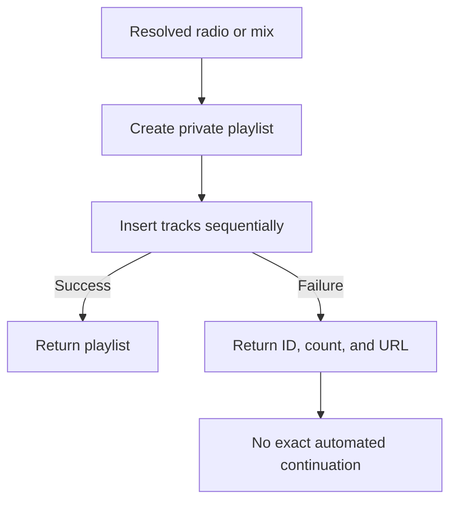
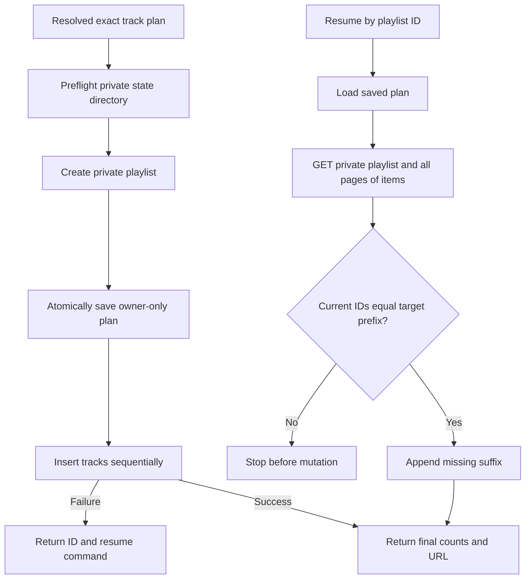

# Durable playlist resume

## 1. Evidence sources

- `yt_mcp.py` creates a private playlist and inserts items sequentially through
  the official YouTube Data API.
- The previous writer stopped on the first failed insert and returned the safe
  playlist ID, completed count, and URL, but kept no exact recovery plan.
- `oauth.json` and `oauth-client.json` are already owner-only, ignored files.
- Google documents `playlists.list` for retrieving one playlist and
  `playlistItems.list` with a maximum page size of 50 and `nextPageToken`.
- The existing Italian playlist stopped at 23 of 100 tracks, establishing the
  concrete recovery case.

## 2. Current flow

## 3. Desired flow

## 4. Behavioral delta

- Every new playlist gets `.yt-mcp-state/PLAYLIST_ID.json` before its first item
  insert.
- CLI adds `yt playlist resume PLAYLIST_ID`.
- MCP adds `resume_private_playlist(playlist_id)` with a conservative
  non-idempotent write annotation because concurrent calls are not serialized.
- The official API client adds authenticated GET/pagination and a single forced
  token refresh after HTTP 401.
- Default credential names work together without `.env`; explicit environment
  configuration retains precedence.

Creation, radio mixing, private visibility, result limits, and sanitized error
boundaries otherwise remain unchanged.

## 5. Decisions and open questions

- The saved exact plan is authoritative; resume never regenerates a changing
  radio queue.
- Remote playlist contents are authoritative for progress. They must be an
  exact target prefix, covering the case where an insert succeeded but its
  response was lost.
- A missing, malformed, over-permissive, reordered, non-private, or foreign
  playlist stops before insertion.
- Completed manifests are retained so sequential repeated resume calls remain
  safe no-ops.
- Manifests contain one to 100 unique video IDs and carry an HMAC derived from
  the OAuth client secret. Altered or oversized state is rejected before a
  network request.
- The pre-feature 23-track playlist is bootstrapped once from its existing IDs
  plus 77 unique tracks from a fresh mix; all future creates write state
  automatically.
- Cleanup and deletion remain out of scope.

## 6. Delivery steps

1. Resolve `oauth-client.json` beside `oauth.json` when no explicit credential
   environment is configured.
2. Persist and validate an owner-only, versioned, authenticated resume manifest.
3. List playlist metadata and all playlist items through paginated official API
   GETs.
4. Reconcile an exact prefix and append only its suffix.
5. Expose CLI and MCP resume surfaces and document focused Codex approval rules.
6. Bootstrap and resume the existing Italian playlist, then verify a second
   resume performs zero inserts.

## 7. Acceptance criteria and tests

- A manifest exists before the first playlist item insert and survives a partial
  failure with mode `0600`.
- Expired tokens refresh through the sibling client file without `.env`; an HTTP
  401 is refreshed and retried once only.
- Resume appends only a matching missing suffix and returns before/added/final
  counts.
- A complete playlist performs no POST; a mismatch performs no POST and reports
  a safe error.
- CLI resume requires the playlist ID, OAuth token, and matching sibling or
  explicitly configured OAuth client; it does no anonymous discovery.
- MCP exposes a typed, non-read-only, non-destructive, non-idempotent resume
  tool; sequential completed retries remain no-ops.
- Unit tests make no live account changes; the explicitly authorized live
  recovery is separately verified at 100 tracks.

## 8. Risks, rollout, and rollback

List calls consume API quota and item inserts remain individually non-atomic.
The authenticated manifest makes those partial writes recoverable but does not
serialize concurrent resume calls or prevent a race with simultaneous manual
edits. Strict prefix validation favors a safe stop over guessing.

Permanent MCP write approval additionally requires a reviewed, non-editable
server installation and OAuth/resume files outside agent-writable workspaces.
Tool-name approval alone does not pin the implementation or local state.

Rollback removes the resume command/tool and manifest writes. Existing ignored
manifest files can remain harmlessly or be deleted manually; no playlist data
must be migrated or removed.
